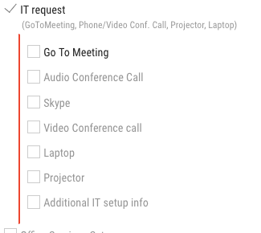
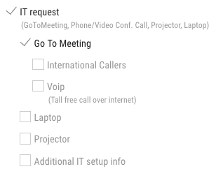

## Request Generator 

A better interface to complex request forms. It allows user to concentrate only on available and required choices relevant to the responses entered.  Providing only relevant options is aiding in reducing complexity significantly.  

It takes an advantage of conversational approach of  wizzard interface pattern without limitation of loss of content entered and context and ability of non-sequential content completion.

At the end of request text summary of request is generated that can be used in text based content correspondence such as email.

[View application demo](http://request-app.nkviduu.tech/demo)

----

 

### Additional features

Once an item is selected it reveals choices and requirements available for it.  Required selections are marked with red line.

 

The list allows to define subselections where selecting an item would hide other no longer
applicable selections leaving relevant selections visible.  
I the example above 
* GoTo Meeting, 
* Audio Conference Call,
* Skype,
* Video Conference Call

are mutually exlusive, so when one is selected remaining choices are hidden

 

Implementation - Angular 7. 

[Implementation detail](http://request-app.nkviduu.tech/about)
